# EMR Notebooks

Apache Spark on EMR is a popular tool for processing data for machine learning. Using Spark you can enrich and reformat large datasets. EMR Notebooks are familiar Jupyter notebooks that can connect/disconnect to EMR clusters and run Spark jobs on the cluster. The notebook code is persisted durably to S3. By using EMR Notebooks you separate the execution (EMR) and code development (Notebook) environments. Using EMR Notebooks allows you to share the EMR cluster between users and move the development environment to other clusters as needed. 

## Create an EMR Notebook

* Go to Amazon EMR console browser tab, and click on Notebooks on the left-hand column

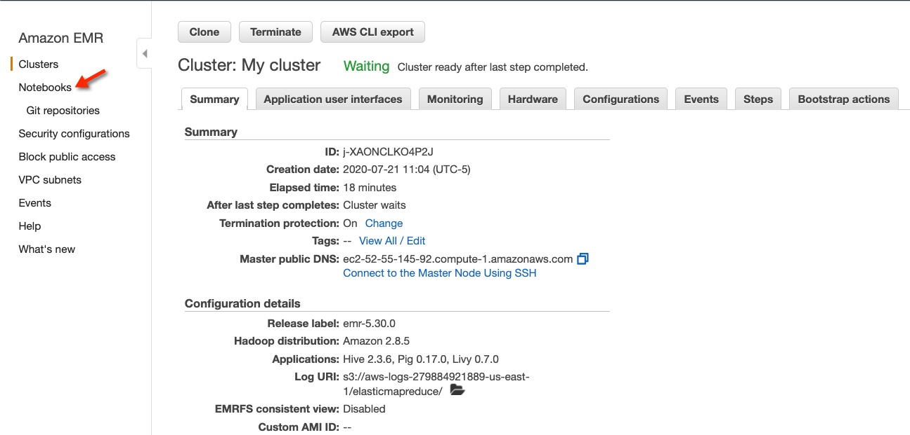

* Click on Create notebook

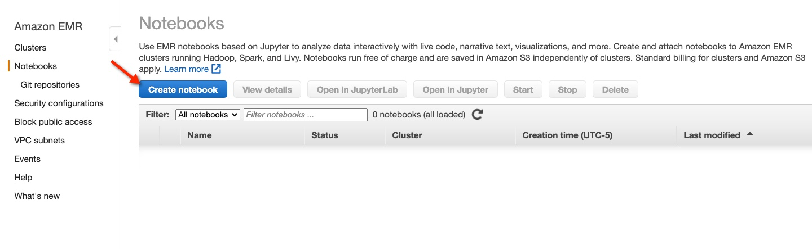

* Enter "EMRnotebook" for the name.  Then click on the Choose button to choose an existing cluster.  Select your cluster.  Then click Choose cluster.

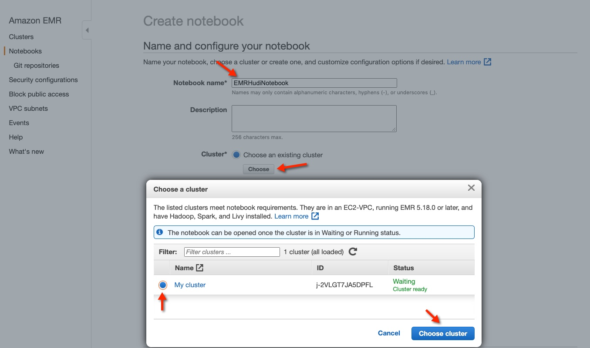

* Leave the rest at their defaults and click Create notebook

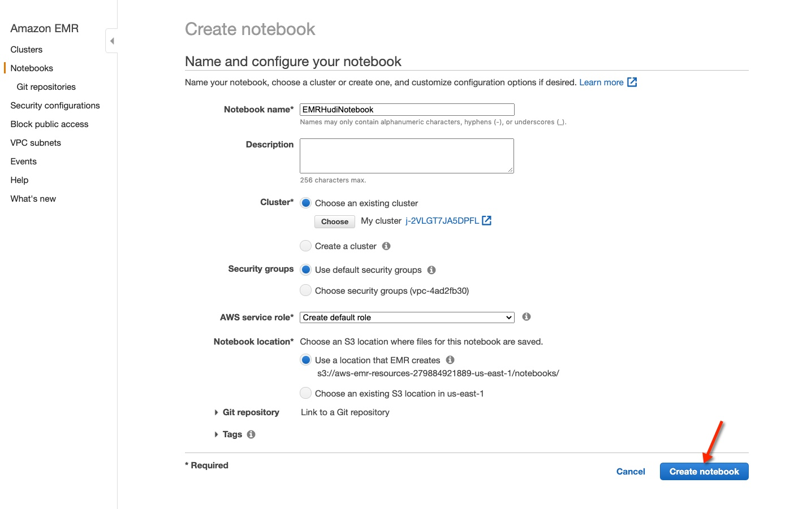

* Wait for your Notebook to be Ready.  Then click Open in Jupyter

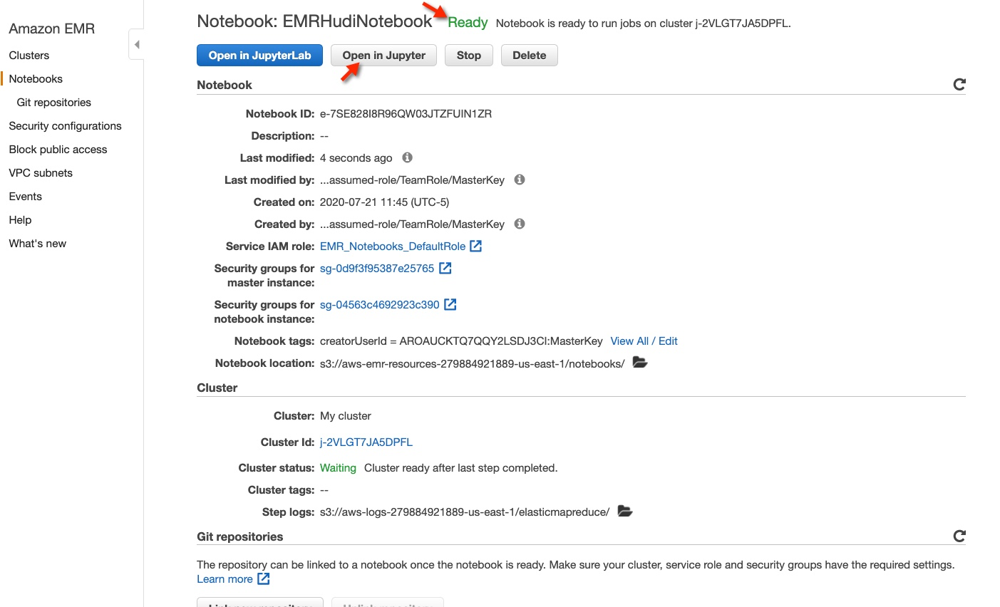

Your Jupyter environment should open:

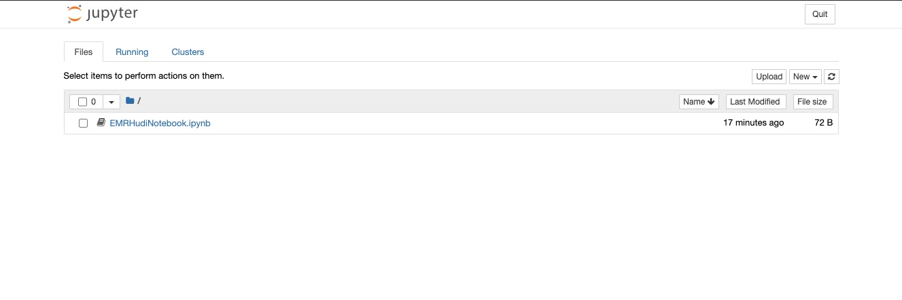


## Creating a S3 bucket

* In the Cloud9 environment, create a new terminal window.

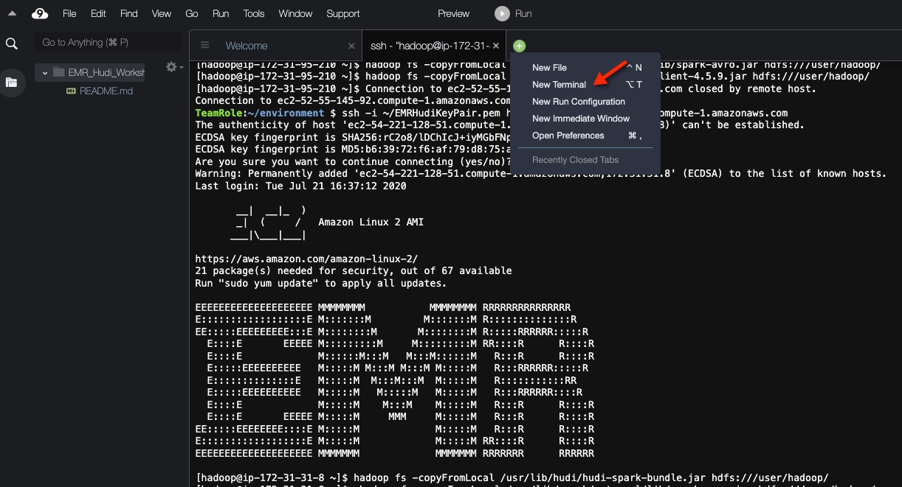

* Copy the following code and paste and run it in the new terminal

```

## Sets up S3 bucket for you
export AWSACCOUNT=`aws sts get-caller-identity --query Account --output text`
export BUCKET=emr-hudi-workshop-$AWSACCOUNT
echo S3 Bucket is $BUCKET

# Make the bucket
aws s3 mb s3://$BUCKET
aws s3 ls

```


* This bucket name will be used in the Jupyter notebook for Hudi

## Loading the Hudi notebook into Jupyter

* Download the Hudi notebook from [here](https://bit.ly/hudi-notebook-v1)
* Download the schema file which will be used in the notebook from [here](https://bit.ly/schema-file)

* Upload the notebook using Jupyter by selecting the upload button and choosing the ipynb file that was downloaded

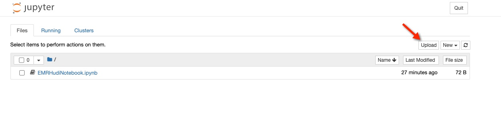

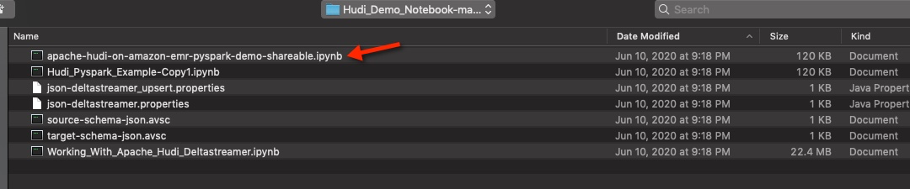

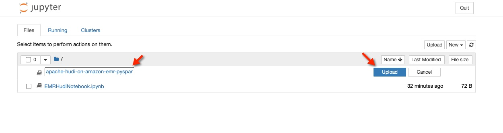

* Once you uploaded the file into Jupyter, click on the file to open the notebook

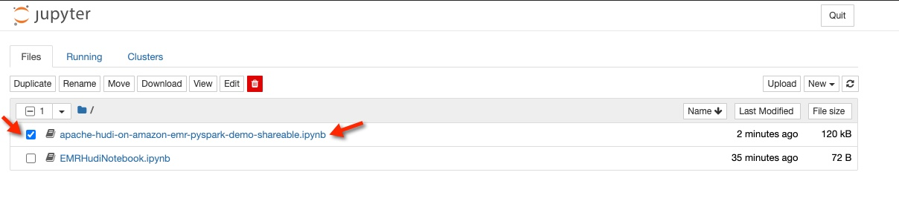

* You should see a screen similar to below

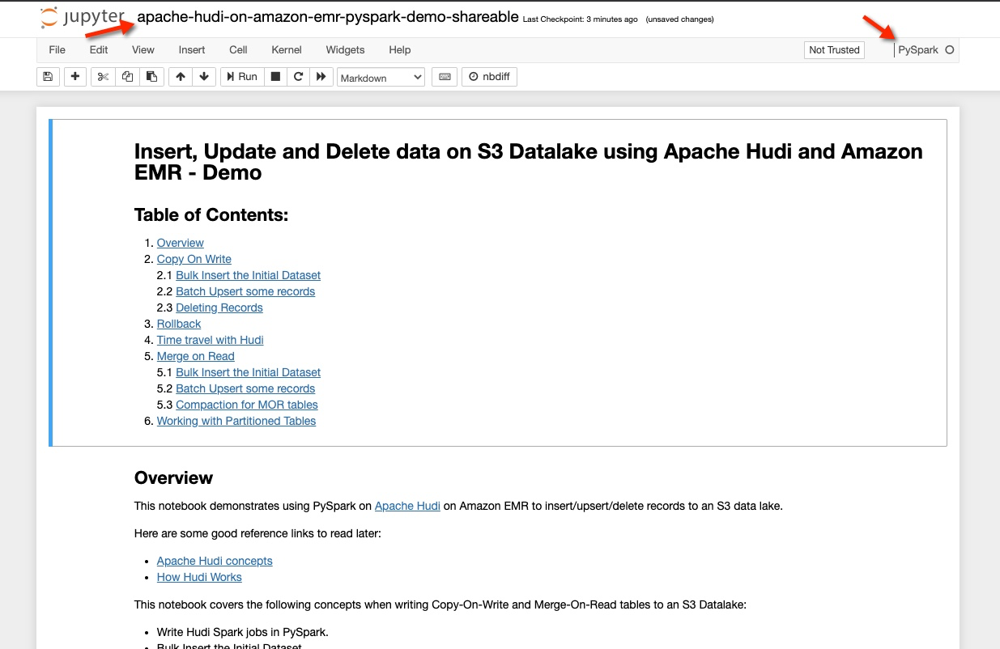

* This notebook is self explanatory and run through the cells to see Hudi on EMR in action.


## Congratulations - you have created an EMR Notebook, an S3 bucket and uploaded a Hudi Notebook

Thank you for your time and attention.
